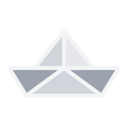

# BuildWithDani

 

 

> One person. No investors. No roadmap decks.
> If it's worth building, it gets built. If it's worth shipping, it ships before it's perfect.

 

**Fast** — idea to shipped in days &nbsp;·&nbsp; **Real** — solves an actual problem first &nbsp;·&nbsp; **Quiet** — we announce ships, not roadmaps

 

### Stack

 

More on the way. Follow along on X for what ships next.

